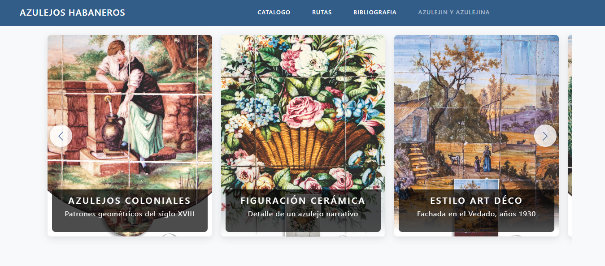
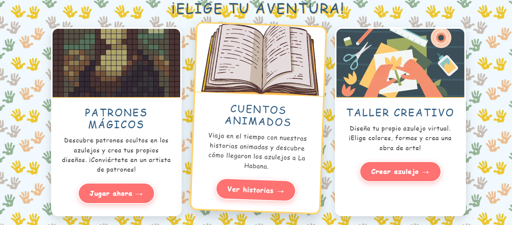

# proyectAzulejos

[](https://www.python.org/)
[](https://www.djangoproject.com/)
[]()
[](LICENSE)
[](https://github.com/Nostrad4mus/proyectAzulejos/issues)

> **proyectAzulejos** es una plataforma web desarrollada con Django para la gestión integral de catálogos de azulejos, permitiendo la administración eficiente de productos, categorías y pedidos a través de una interfaz moderna y sencilla.

---

## 🖼️ Capturas de pantalla

<!-- Añade aquí tus imágenes -->



---

## 🚀 Tecnologías principales

- **Python 3.8+**
- **Django 4.x**
- **HTML5, CSS3, JavaScript** (con Bootstrap opcional)
- **SQLite** (por defecto, fácilmente migrable a PostgreSQL/MySQL)
- **pytest/unittest** para pruebas automatizadas

---

## ✨ Funcionalidades principales

- Gestión CRUD de azulejos y categorías
- Panel de administración personalizado
- Formularios de alta y edición con validaciones
- Migraciones automáticas de base de datos
- Sistema de plantillas HTML adaptable para frontend
- Gestión de archivos estáticos y media
- Tests unitarios e integración

---

## 📂 Estructura del proyecto

```
proyectAzulejos/
├── client/
│   ├── admin.py
│   ├── forms.py
│   ├── migrations/
│   ├── models.py
│   ├── static/
│   ├── templates/
│   ├── tests.py
│   ├── urls.py
│   └── views.py
├── server/
│   ├── settings.py
│   ├── urls.py
│   └── ...
├── manage.py
└── README.md
```

---

## ⚙️ Instalación rápida

1. **Clona el repositorio:**
   ```sh
   git clone https://github.com/Nostrad4mus/proyectAzulejos.git
   cd proyectAzulejos
   ```

2. **Crea y activa un entorno virtual:**
   ```sh
   python3 -m venv env
   source env/bin/activate
   ```

3. **Instala las dependencias:**
   ```sh
   pip install -r requirements.txt
   ```

4. **Aplica migraciones y ejecuta el servidor:**
   ```sh
   python manage.py migrate
   python manage.py runserver
   ```

---

## 🧑‍💻 Contribución

¿Te gustaría mejorar este proyecto? ¡Eres bienvenido! Por favor, abre un [issue](https://github.com/Nostrad4mus/proyectAzulejos/issues) o un pull request. Consulta las [Normas de Contribución](CONTRIBUTING.md) si existen.

---

## 👤 Autores y contactos

- **Autores:** Nostrad4mus y Jorge Cabrera
- **Repositorio:** [github.com/Nostrad4mus/proyectAzulejos](https://github.com/Nostrad4mus/proyectAzulejos)
- **Email:** nostrad4mus@gmail.com y emaildejorge@example.com

---

## 📄 Licencia

Distribuido bajo licencia MIT. Consulta el archivo [LICENSE](LICENSE).

---

> Personaliza este README según los detalles y fortalezas de tu proyecto. ¡Las secciones y badges están listas para que brilles en GitHub!
